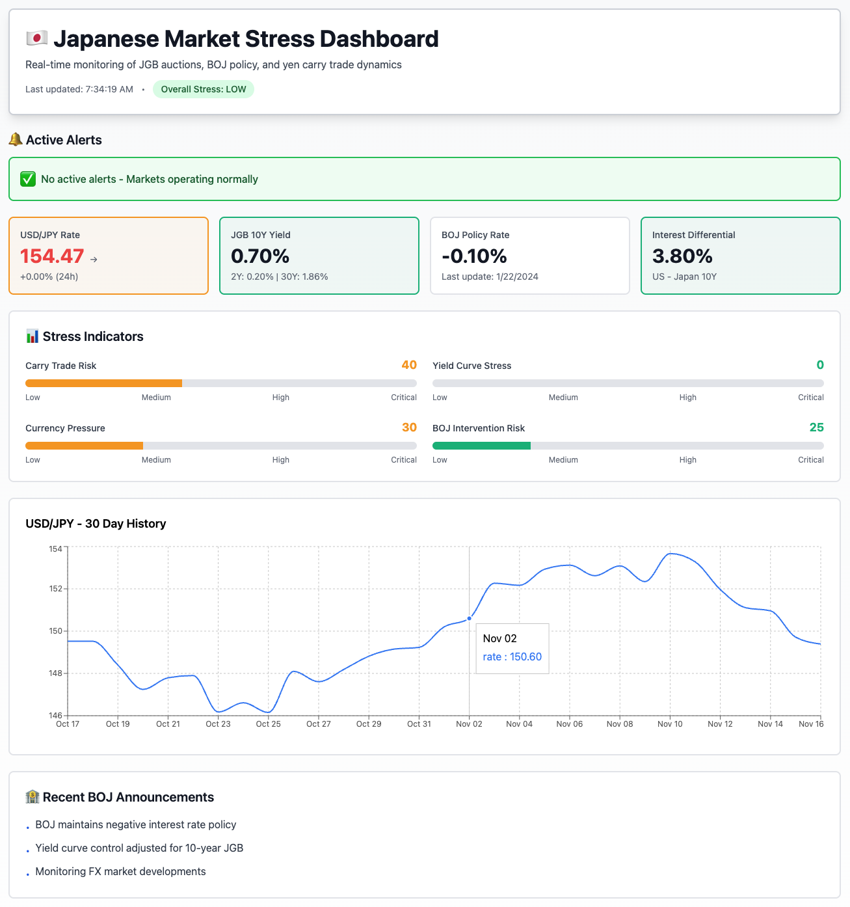

# 🇯🇵 Japanese Yen Market Stress Dashboard

A real-time monitoring system that tracks Japanese Government Bond (JGB) auction results, Bank of Japan (BOJ) policy signals, and yen carry trade dynamics. The dashboard aggregates data from multiple sources, calculates stress indicators, and generates alerts when conditions emerge for potential JPY/USD devaluation.



## 🌟 Features

- **Live FX Monitoring**: Track USD/JPY exchange rates with real 24-hour changes and historical trends
- **Live JGB Yield Tracking**: Monitor 2Y, 5Y, 10Y, and 30Y Japanese Government Bond yields from live sources
- **Live BOJ Policy Signals**: Track Bank of Japan policy rates and latest announcements via RSS feed
- **Carry Trade Risk Analysis**: Calculate interest rate differentials and volatility metrics from real data
- **Comprehensive Stress Indicators**:
  - Carry Trade Risk Score
  - Yield Curve Stress Level
  - Currency Pressure Index
  - BOJ Intervention Risk Assessment
- **Smart Alerts**: Automatic notifications when critical thresholds are reached
- **Auto-refresh**: Data updates every 5 minutes automatically with intelligent caching
- **Live Data Integration**: Optional real-time data from Alpha Vantage, FRED API, and BOJ RSS
- **Graceful Fallbacks**: Works perfectly even without API keys using realistic mock data
- **Mobile Responsive**: Works seamlessly on desktop, tablet, and mobile devices

## 🎯 What It Monitors

### 1. Currency Metrics
- **USD/JPY Exchange Rate**: Current rate, 24h change, and historical trends
- **Volatility Analysis**: Rolling volatility calculations
- **Momentum Indicators**: Rate of change detection

### 2. Bond Market Indicators
- **JGB Yields**: 2-year, 5-year, 10-year, and 30-year yields
- **Yield Curve Shape**: Detect flattening, steepening, or inversion
- **Spread Analysis**: Monitor term spreads for stress signals

### 3. Policy Signals
- **BOJ Policy Rate**: Current policy rate tracking
- **Recent Announcements**: Latest BOJ communications
- **Intervention Thresholds**: Historical intervention level monitoring

### 4. Carry Trade Dynamics
- **Interest Rate Differential**: US-Japan 10Y spread
- **Risk-Adjusted Returns**: Volatility-adjusted carry metrics
- **Unwinding Risk**: Early warning signals for carry trade reversals

## 🚀 Quick Start

### Prerequisites
- Node.js 18+ and npm
- Git
- (Optional) Free API keys for live data - see [LIVE_DATA_SETUP.md](LIVE_DATA_SETUP.md)

### Local Development

1. **Clone the repository**
   ```bash
   git clone <repository-url>
   cd jpy
   ```

2. **Install dependencies**
   ```bash
   npm install
   ```

3. **[Optional] Set up live data integration**
   ```bash
   cp .env.example .env.local
   # Edit .env.local with your API keys (see LIVE_DATA_SETUP.md)
   ```

4. **Run the development server**
   ```bash
   npm run dev
   ```

5. **Open your browser**
   Navigate to [http://localhost:3000](http://localhost:3000)

> **Note**: The dashboard works without API keys using fallback data. For live data integration, see [LIVE_DATA_SETUP.md](LIVE_DATA_SETUP.md).

## 🌐 Deploy to Vercel (Free)

This dashboard is designed to run on Vercel's free tier with zero configuration needed.

### One-Click Deploy

[](https://vercel.com/new/clone?repository-url=https://github.com/yourusername/jpy)

### Manual Deploy

1. **Install Vercel CLI**
   ```bash
   npm i -g vercel
   ```

2. **Deploy**
   ```bash
   vercel
   ```

3. **Follow the prompts**
   - Link to existing project or create new
   - Select your preferred settings
   - Deploy!

Your dashboard will be live at `https://your-project.vercel.app`

### Vercel Free Tier Limits
- ✅ 100 GB bandwidth/month
- ✅ 100 deployments/day
- ✅ Serverless function executions
- ✅ Automatic HTTPS
- ✅ Custom domains

## 📊 Understanding Stress Indicators

### Carry Trade Risk (0-100)
Measures the probability of yen carry trade unwinding:
- **0-25 (Low)**: Stable carry trade environment
- **25-50 (Medium)**: Elevated monitoring required
- **50-75 (High)**: Significant unwinding risk
- **75-100 (Critical)**: Imminent carry trade reversal likely

**Triggers**:
- Interest rate differential < 2%
- FX volatility > 10%
- Rapid JPY appreciation

### Yield Curve Stress (0-100)
Monitors JGB market health:
- **Indicators**: Absolute yield levels, curve shape, spread compression
- **Critical Levels**: 10Y yield > 1.0%, 2-10 spread < 0.3%

### Currency Pressure (0-100)
Tracks USD/JPY stress:
- **Key Levels**:
  - 150 = Elevated concern
  - 155 = High alert
  - 160+ = Intervention threshold

### BOJ Intervention Risk (0-100)
Estimates probability of BOJ FX intervention:
- **Historical Context**: BOJ has intervened around 145-160 levels
- **Factors**: FX level, rate of change, yield stress, policy signals

## 🔧 Architecture

```
┌─────────────┐
│   Browser   │
└──────┬──────┘
       │
       ▼
┌─────────────────────────────┐
│   Next.js Frontend (React)  │
│   - Dashboard UI            │
│   - Charts (Recharts)       │
│   - Auto-refresh (SWR)      │
└──────┬──────────────────────┘
       │
       ▼
┌─────────────────────────────┐
│   API Routes (Serverless)   │
│   /api/dashboard            │
│   /api/health               │
└──────┬──────────────────────┘
       │
       ▼
┌─────────────────────────────┐
│   Data Fetchers             │
│   - FX API (open.er-api)    │
│   - JGB Data (mock/scrape)  │
│   - BOJ Policy (static)     │
└──────┬──────────────────────┘
       │
       ▼
┌─────────────────────────────┐
│   Stress Calculator         │
│   - Carry trade metrics     │
│   - Alert generation        │
│   - Risk scoring            │
└─────────────────────────────┘
```

## 📁 Project Structure

```
jpy/
├── components/           # React components
│   ├── MetricCard.tsx   # Metric display cards
│   ├── AlertPanel.tsx   # Alert notifications
│   ├── StressGauge.tsx  # Stress level gauges
│   └── RateChart.tsx    # Historical rate charts
├── lib/                 # Core logic
│   ├── types.ts         # TypeScript interfaces
│   ├── dataFetchers.ts  # Data source integrations
│   └── stressCalculator.ts # Stress indicator logic
├── pages/
│   ├── api/
│   │   ├── dashboard.ts # Main API endpoint
│   │   └── health.ts    # Health check
│   ├── _app.tsx         # Next.js app wrapper
│   └── index.tsx        # Main dashboard page
├── public/              # Static assets
├── styles/              # Global styles
│   └── globals.css
└── package.json         # Dependencies
```

## 🔌 Data Sources

### ✨ LIVE DATA INTEGRATION NOW AVAILABLE!

The dashboard now supports **real-time live data** from multiple sources. See **[LIVE_DATA_SETUP.md](LIVE_DATA_SETUP.md)** for complete setup instructions.

### Current Implementation

1. **FX Rates**: Live data with intelligent fallback
   - **Primary**: [Open Exchange Rates API](https://open.er-api.com/) (free, no key required)
   - **Enhanced**: Alpha Vantage for historical data and 24h changes (free API key required)
   - Real-time USD/JPY rates with actual 24-hour change tracking

2. **JGB Yields**: Live Japanese Government Bond yields
   - **Primary**: FRED API for 10-year JGB yields (free API key recommended)
   - **Fallback**: Realistic mock data based on current market conditions
   - Other maturities estimated from yield curve relationships

3. **BOJ Policy**: Live announcements from Bank of Japan
   - **Live**: BOJ RSS feed for latest announcements (automatic, no key required)
   - **Policy Rate**: Updated during BOJ policy meetings
   - Fallback announcements if RSS feed is unavailable

4. **Historical Data**: 30-day FX trends
   - **Live**: Alpha Vantage historical FX data (free API key required)
   - **Fallback**: Realistic mock trend data

### 🚀 Quick Setup for Live Data

1. **Get free API keys** (optional but recommended):
   - [Alpha Vantage](https://www.alphavantage.co/support/#api-key) - For FX historical data (500 calls/day free)
   - [FRED API](https://fredaccount.stlouisfed.org/apikeys) - For JGB yields (unlimited free)

2. **Configure environment**:
   ```bash
   cp .env.example .env.local
   # Edit .env.local and add your API keys
   ```

3. **Install and run**:
   ```bash
   npm install
   npm run dev
   ```

**See [LIVE_DATA_SETUP.md](LIVE_DATA_SETUP.md) for detailed instructions, troubleshooting, and API management.**

### Data Quality & Reliability

- **Intelligent Caching**: 5-minute cache reduces API calls and ensures fast loading
- **Graceful Fallback**: Dashboard works even if APIs are unavailable
- **Rate Limit Management**: Optimized refresh intervals stay within free tier limits
- **Error Handling**: Robust error handling ensures continuous operation

## 🎨 Customization

### Modify Alert Thresholds

Edit `lib/stressCalculator.ts`:

```typescript
// Example: Change FX intervention threshold
if (fx.rate > 160) {  // Change this value
  alerts.push({
    severity: 'critical',
    message: 'USD/JPY intervention threshold reached'
  });
}
```

### Add New Metrics

1. Define type in `lib/types.ts`
2. Create fetcher in `lib/dataFetchers.ts`
3. Add calculation in `lib/stressCalculator.ts`
4. Display in `pages/index.tsx`

### Styling

The project uses Tailwind CSS. Modify theme in `tailwind.config.js`:

```javascript
theme: {
  extend: {
    colors: {
      danger: '#ef4444',  // Customize colors
      warning: '#f59e0b',
      success: '#10b981',
    },
  },
}
```

## 🚨 Alert Configuration

Alerts are triggered automatically based on:

- **FX Levels**: USD/JPY > 155 (warning), > 160 (critical)
- **Carry Trade Risk**: Score > 50 (warning), > 70 (critical)
- **JGB Yields**: 10Y > 0.85% (warning), > 1.0% (critical)
- **Volatility**: Annualized > 10% (warning), > 15% (critical)

## 📈 Future Enhancements

- [x] Live FX data with 24h changes (Alpha Vantage)
- [x] Live JGB yield tracking (FRED API)
- [x] Live BOJ announcements (RSS feed)
- [x] Intelligent caching system
- [ ] Email/SMS alert notifications
- [ ] Historical data storage (database)
- [ ] Machine learning predictions
- [ ] Multi-currency monitoring
- [ ] Options market sentiment
- [ ] News sentiment analysis
- [ ] Export to CSV/PDF
- [ ] Customizable alert thresholds via UI
- [ ] WebSocket real-time updates
- [ ] Ministry of Finance JGB auction scraper

## 🤝 Contributing

Contributions are welcome! Please feel free to submit a Pull Request.

1. Fork the repository
2. Create your feature branch (`git checkout -b feature/AmazingFeature`)
3. Commit your changes (`git commit -m 'Add some AmazingFeature'`)
4. Push to the branch (`git push origin feature/AmazingFeature`)
5. Open a Pull Request

## 📝 License

This project is licensed under the MIT License - see the [LICENSE](LICENSE) file for details.

## ⚠️ Disclaimer

This dashboard is for informational and educational purposes only. It does not constitute financial advice, investment advice, trading advice, or any other sort of advice. You should not treat any of the dashboard's content as such. Do your own research and consult with financial professionals before making any investment decisions.

The data sources used may have limitations, delays, or inaccuracies. Always verify critical information from official sources.

## 🙏 Acknowledgments

- Data provided by Open Exchange Rates API
- Built with Next.js, React, and Tailwind CSS
- Charts powered by Recharts
- Hosted on Vercel

## 📧 Contact

For questions or feedback, please open an issue on GitHub.

---

**Made with ❤️ for financial markets monitoring**
